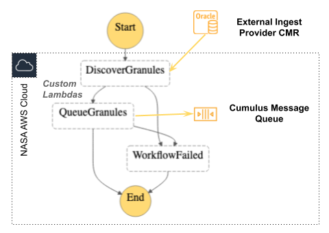

# NASA-NOAA Collaborative Platform Pilot (NNCPP) Cumulus Template Deployment Project
This project is a clone of the [Cumulus Template Deployment Project](https://github.com/nasa/cumulus-template-deploy) with helper scripts for the inital setup.

- [How To Deploy](#how-to-deploy)
- [Deployment VPC Notes](#deployment-vpc-notes)
- [Use AWS CDK to provision prerequisite resources (one time)](#use-aws-cdk-to-provision-prerequisite-resources-one-time)
  - [Developer tools](#developer-tools)
  - [Environment configuration](#environment-configuration)
  - [Execute setup scripts](#execute-setup-scripts)
- [AWS account inventory and set-up](#aws-account-inventory-and-set-up)
- [Terraform](#terraform)
  - [Install terraform](#install-terraform)
  - [Notes about Cumulus version](#notes-about-cumulus-version)
  - [Configure and deploy data-persistence-tf module](#configure-and-deploy-data-persistence-tf-module)
  - [Publish the Cumulus Message Adapter layer](#publish-the-cumulus-message-adapter-layer)
  - [Configure and deploy cumulus-tf root module](#configure-and-deploy-cumulus-tf-root-module)
  - [Troubleshooting](#troubleshooting)
- [Running Cumulus locally](#running-cumulus-locally)
  - [Cumulus API](#cumulus-api)
  - [Cumulus dashboard](#cumulus-dashboard)
- [Add workflows](#add-workflows)
  - [Custom lambdas and additions.tf](#custom-lambdas-and-additionstf)
  - [Add provider, collection(s), and rule(s)](#add-provider-collections-and-rules)
- [COG ingestion pipeline](#cog-ingestion-pipeline)
  - [Data prerequisites](#data-prerequisites)
  - [Discover and queue granules workflow](#discover-and-queue-granules-workflow)
  - [Publish granules workflow](#publish-granules-workflow)
  - [Execution rule](#execution-rule)

## How To Deploy 
This document supplements the primary [Cumulus Deployment How To Documentation](https://nasa.github.io/cumulus/docs/deployment/deployment-readme) with a high level overview of the steps taken to deploy the NNCPP project which does not require the full architecture deployment in the primary documentation. Deploying this project involves some one time resource creation and account lookups before the Cumulus terraformation tools can be used.

## Deployment VPC Notes
This Cumulus deployment assumes that a configured VPC is already available. If issues are encountered during deployment or when using Cumulus and CMR in a VPC, the following notes may be helpful.

* Cumulus must be deployed in the same VPC as the CMR that it will ingest data into.
* VPC must have at least two private subnets and one public subnet for CMR. One or both of the private subnet ids will be used in the the data persistence and cumulus module deployments below.
* VPC must have a [Private Interface Endpoint](https://docs.aws.amazon.com/vpc/latest/privatelink/vpce-interface.html) and should use the default VPC security group. If DNS issues are encountered when using API Gateway within the VPC, check inbound and outbound configuration in [security groups](https://docs.aws.amazon.com/vpc/latest/userguide/VPC_SecurityGroups.html).

## Use AWS CDK to provision prerequisite resources (one time)
### Developer tools 
* [AWS Command Line Interface](https://aws.amazon.com/cli/)
* [Named AWS Profile Configuration](https://docs.aws.amazon.com/cli/latest/userguide/cli-configure-profiles.html) for AWS CLI
* [Node Version Manager](https://github.com/nvm-sh/nvm)
* Brew install python, [pyenv](https://github.com/pyenv/pyenv), and [pipenv](https://github.com/pypa/pipenv). *Note: homebrew install of pipenv is now [discouraged](https://github.com/pypa/pipenv/blob/master/docs/install.rst#-homebrew-installation-of-pipenvdiscouraged).*

### Environment configuration
For this example, the named AWS profile is "nasa-noaa-cds" and the deployment prefix is "nncpp". Note that the prefix is applied in resource naming and tagging.

Create a `.env` file in the main directory and update the values in the example below for your deployment. For this example, the named AWS profile is "nasa-noaa-cds" and the project identifier/deployment prefix is "nncpp". Note that the prefix is applied in resource naming and tagging. Stage is used to differentiate the given AWS account, i.e. dev or prod.
```
IDENTIFIER="nncpp"
STAGE="dev"
AWS_DEFAULT_REGION="us-west-2"
AWS_DEFAULT_PROFILE="nasa-noaa-cds"
```

### Execute setup scripts
The [Makefile](Makefile) included in this project contains commonly used commands deploy the resources defined in the [cdk](cdk) directory using a virtual environment. To get started, install the pipenv requirements, run a `diff` to compare the resources to be deployed to what is already in the cloud, and finally deploy the changes.
```
make install
# sanity check
make diff
# if the changes look good
make deploy
``` 

## AWS account inventory and set-up
In order to configure the terraformation for the Cumulus deployment, the following information needs to be collected.

1. Choose and note VPC and subnet ids. These will be needed to deploy the cumulus-tf module.
2. Lookup the ecs-optimized-ami with the following command and note the `image_id` (beggining with `ami-`) in the result. This will be assigned to the `ecs_cluster_instance_image_id` variable in the cumulus-tf module deployment.
    ```
    aws ssm get-parameters --names /aws/service/ecs/optimized-ami/amazon-linux-2/recommended
    ```
    For other Linux variants see the [Linux Amazon ECS-optimized AMIs docs](https://docs.aws.amazon.com/AmazonECS/latest/developerguide/ecs-optimized_AMI.html#ecs-optimized-ami-linux). 
3. Check elasticsearch service role
    ```
    aws iam get-role --role-name AWSServiceRoleForAmazonElasticsearchService
    ```
    If no role exists yet, create and tag it.
    ```
    aws iam create-service-linked-role --aws-service-name es.amazonaws.com
    aws iam tag-role --role-name AWSServiceRoleForAmazonElasticsearchService --tags "Key=Project,Value=$IDENTIFIER"
    ```

## Terraform
Now the Data Persistence and Cumulus modules can be deployed. For resource naming and tagging, two conventions are used. The `IDENTIFIER` set in the .env file is used for tagging resources with the project name, this can be duplicated across AWS accounts. The `PREFIX` used in the deployoment below needs to be unique across all environments so use `PREFIX=$IDENTIFIER-$STAGE` to set a unique prefix.

### Install terraform
Install terraform using these [Cumulus terraform installation steps](https://nasa.github.io/cumulus/docs/deployment/deployment-readme#install-terraform). 

### Notes about Cumulus version
The currently deployed Cumulus stack was first deployed with [v0.7.0 terraformation scripts](https://github.com/nasa/cumulus-template-deploy/tree/de47a35e79058d448a03d0405a006f0a35dbd441) manually upgraded to v8.1.0 with a global replace of the the cumulus module source (find and replace `v<desired version>`). The Cumulus stack was later upgraded to v8.1.2 to integrate a bug fix that was impacting data downloads from LPDAAC.

[RDS migration steps should be followed if upgrading to Cumulus v9.0.1 or later](https://nasa.github.io/cumulus/docs/upgrade-notes/upgrade-rds). 

### Configure and deploy data-persistence-tf module

#### Copy and update terraform.tf and terraform.tfvars
These changes need to made locally to correspond the the AWS account and local environment variables set above for each deployment. The changes contain secrets and are not meant to be checked in to github.
```
cd data-persistence-tf
cp terraform.tf.example terraform.tf
cp terraform.tfvars.example terraform.tfvars
```
1. Update the region to agree with the deployment account, i.e. `us-west-2`
1. Replace `PREFIX` with the value of `$IDENTIFIER-$STAGE`, i.e. `nncpp-dev`
1. In terraform.tfvars, replace the dummy `subnet_id` with the subnet_id(s) identified in in the account set-up step above--this will ensure that the Elasticsearch Service is created in the Cumulus VPC. These should be the same subnet ids assigned to the `lambda_subnet_ids` array in the cumulus-tf module terraformation. 
1. Add resource tags:
  Define Project tag in `terraform.tfvars`
  ```
  tags = {
      Project = <IDENTIFIER>
  }
  ```

#### Deploy data-persistence-tf module
After configuring the terraformation scripts for the data persistence module, the following commands can be used to deploy the changes to AWS. Detailed instructions for this step can be found in the primary Cumulus documentation starting [here](https://nasa.github.io/cumulus/docs/deployment/deployment-readme#initialize-terraform).

```
terraform init
# should see:
Terraform has been successfully initialized!

# optional (you will be prompted to confirm in apply step so the plan preview is not essential)
terraform plan

# deploy
terraform apply
```

### Publish the Cumulus Message Adapter layer
Download zip from [releases](https://github.com/nasa/cumulus-message-adapter/releases). Using v1.3.0.
Publish layer. The layer version published here will be used in the cumulus-tf module deployment.
```
aws lambda publish-layer-version \
  --layer-name "$PREFIX-CMA-layer" \
  --region us-west-2 \
  --zip-file fileb:///path/to/cumulus-message-adapter.zip
```

*Note: if the publish command exits with connection closed before response try [adjusting timeout](https://github.com/aws/aws-cli/issues/3842)*
```
aws lambda publish-layer-version \
  --layer-name "$PREFIX-CMA-layer" \
  --region us-west-2 \
  --zip-file fileb:///path/to/cumulus-message-adapter.zip \
  --cli-connect-timeout 6000
```

### Configure and deploy cumulus-tf root module
#### NGAP deployments only
This project is configured for a non-NGAP deployment. To deploy to an NGAP account update `deploy_to_ngap = true` in `main.tf`.

#### Copy and update terraform.tf and terraform.tfvars
```
cd cumulus-tf/
cp terraform.tf.example terraform.tf
cp terraform.tfvars.example terraform.tfvars
```
1. Update `region` to agree with the deployment account, i.e. `us-west-2`.
1. Fill `ecs_cluster_instance_image_id` with the ecs-optimized-ami retrieved above.
1. If not deploying to an NGAP account, comment out `permissions_boundary_arn` because it is not available to non-NGAP deployments.
1. Update cumulus_message_adapter_lambda_layer_version_arn to agree with the layer version published above.
1. Replace `PREFIX` with the value of `$IDENTIFIER-$STAGE`, i.e. `nncpp-dev`.
1. Fill vpc_id to agree with the id identified above.
1. `ecs_cluster_instance_subnet_ids` remove dummy subnet_id and leave an empty list.
1. `lambda_subnet_ids` fill using subnet_id(s) identified above.
1. Append Earthdata/URS usernames to `api_users` array. The specific Earthdata environment is controlled by the `urs_url` variable to the `cumulus-tf` module.

#### Deploy the cumulus-tf module
From here onward, the cumulus-tf module deployment is the same as the earlier data-persistence deployment.
```
terraform init
terraform plan
terraform apply
```

### Troubleshooting
* [Troubleshooting Cumulus Deployment](https://nasa.github.io/cumulus/docs/troubleshooting/troubleshooting-deployment)
* To find the modeule-specific code referenced in terraform errors messages, visit [cumulus/tf-modules](https://github.com/nasa/cumulus/tree/master/tf-modules).

## Running Cumulus locally
### Cumulus API 
This [wiki](https://wiki.earthdata.nasa.gov/display/CUMULUS/Using+Cumulus+with+Private+APIs) describes how to run the Cumulus API locally (you may need access permissions to view). Below is an overview:
1. Create an ec2 instance in same VPC as the Cumulus deployment using the setup wizard in the AWS console.
   - AWS linux 2 micro instance
   - Choose or create a role with a `AmazonSSMManagedInstanceCore` policy
   - Create a keypair if you don't already have one set-up
   - After downloading keypair, update file permission `chmod 600 the/path/key.pem`
1. Install [AWS CLI session manager plugin](https://docs.aws.amazon.com/systems-manager/latest/userguide/session-manager-working-with-install-plugin.html) 
2. Lookup Cumulus API, it is included in the URI outputs of the terraformation as `https://<api id>.execute-api.<region>.amazonaws.com` or you can find the archive API URI in the API Gateway console.
3. Add Cumulus API to your `/etc/hosts` file for browser access.
  `127.0.0.1   <api-id>.execute-api.<region>.amazonaws.com`
4. Configure port forwarding in `~/.ssh/config` 
  ```
  Host <cumulus name>
    Hostname 127.0.0.1
    User ec2-user
    LocalForward 8000 <cumulus api>:443
    IdentityFile ~/.ssh/<key.pem>
    Port <local ssh port>
  ```
5. Start port forwarding 
   ```
   aws ssm start-session --target <ec2 instance created above> --document-name AWS-StartPortForwardingSession --parameters portNumber=22,localPortNumber=<local ssh port>
   ```
6. In a new terminal, open ssh tunnel
   ```
   ssh <cumulus name>
   ```
7. You can now interact with the [Cumulus API](https://nasa.github.io/cumulus-api/) in your browser. If you have deployed the Cumulus module with your earthdata ID, the following `<api id>.execute-api.<region>.amazonaws.com/token` should redirect you to the earthdata login to obtain a Cumulus token.

### Cumulus dashboard
Clone the [cumulus dashboard](https://github.com/nasa/cumulus-dashboard), configure for the API identified above, build and run.
1. Create `production.env`
  ```
  export APIROOT=https://<api id>.execute-api.<region>.amazonaws.com:8000/dev
  ```
1. Build docker image
  ```
  source production.env && ./bin/build_dashboard_image.sh cumulus-dashboard:production-1
  ```
2. Run docker to use Cumulus dashboard at localhost:3000 (need active SSM port forwarding and SSH tunnel)
  ```
  docker run --rm -it -p 3000:80 cumulus-dashboard:production-1
  ```

## Add workflows
After deploying Cumulus, and assuming CMR has also been deployed to the same account, ingestion workflows can be added to the deployment. 

> For information about deploying CMR, see [this wiki](https://wiki.earthdata.nasa.gov/display/CMR/Forking+CMR+plan) and engage CMR maintainers for support, including access to the wiki itself.

### Custom lambdas and additions.tf
This project borrows heavily from the MAAP cumulus deployment, including using tooling to build and deploy custom lambdas. To use the custom lambda to discover granules in CMR you will need yarn for lambda dependency management and some additional terraformation steps in additions.tf.

#### Get dependencies
If needed, install yarn, `npm -g yarn`, next `yarn install` will install all node modules required to build the custom lambdas.

#### Deploy to cloud
To deploy the custom lambdas `cumulus-tf/additions.tf` was added to the cumulus module deployment. This adds methods to build and package the lambda as well as create the lambda function resource and the step function state machine defined `discover_and_queue_granules.asl.json`. 

To deploy the workflow and components use terraformation.
```
terraform init
terraform apply
```

### Add provider, collection(s), and rule(s)
For this project, the provider, collections, and rules defined in the `data/` directory were added to Cumulus using the Cumulus API and updated using the Cumulus dashboard.

> Caveat: Cumulus API PUT operations currently *merge* rather than replace objects so edits to remove a bad parameter name will not be reflected. The Cumululus dashboard works around this issue. If you must, the edit can be made directly in the DynamoDB console.


## COG ingestion pipeline
The ingestion pipeline used in this project is triggered with the execution of a rule that specifies the collection to ingest and transform and a spatial temporal selection range ([example](data/rules/discover_and_publish_mod13v006.json)) discovers granules from a source CMR (earthdata) and enqueues SQS messages for processing. These messages are consumed by the publish granules workflow which syncs the Hdf4 files from the host where the raw files are served (the "ingestionProvider"), processes Hdf4 to COG format, moves the new COGs to an S3 bucket accessible to the NNCPP dashboard, and publishes metadata for the COG granules to COG collections in both the local CMR and the local Cumulus.

| Discover and Queue Granules Workflow | Publish Granule Workflow |
| --- | --- | 
|  |  |
| ([source](https://docs.google.com/drawings/d/1NLKzR9SwakGKet6xhiCV9RRD_HxEy0SsogTN6ZXqigY/edit)) | ([source](https://docs.google.com/drawings/d/1NwVnNG7EDDmVSOuJ04q_wC6PDHX-KWAW4QhkE49TlRA/edit)) |

### Data prerequisites
* **COG Cumulus and CMR collections** A user-added collection needs to be created in the local CMR for the cloud optimized data generated by the pipeline. For example, when ingesting COGs generated from MOD13Q1, a MOD13Q1_COG collection needs to be created in the local CMR. An equivalent collection needs to be added to Cumulus ([example](data/collections/MOD13Q1___006.json))

* **Ingestion and local CMR providers in Cumulus** In order to discover granules from one host and publish derived COG granules to a new collection on another host, the Cumulus workflow needs an ingestion provider (the source of the raw data) in addition to the local CMR provider. For example, for an ingest pipeline that discovers and downloads MODIS13Q1 granules from a LPDAAC host, the [lpdaac-usgs](data/providers/lpdaac_usgs.json) provider is used to to for data downloads and a local [cmr](data/providers/cmr.json) provider is used to publish the derived COG granules.


### Discover and queue granules workflow
* **State machine definition** [discover_and_queue_granules.asl.json](cumulus-tf/discover_and_queue_granules.asl.json)
* **Discover granules** Custom lambda defined in [lambdas/cmr](cumulus-tf/lambdas/cmr) discovers granules from the ingest CMR and Collection.
* **Queue granules** Custom lambda defined in [lambdas/queueGranules](cumulus-tf/lambdas/queueGranules) inserts custom metadata in SQS granule messages that differentiates the source and destination of the granules handled in the triggered publish granules workflow.

### Publish granules workflow
* **State machine definition** [publish_granule.asl.json](cumulus-tf/publish_granule.asl.json)
* **Sync granules** Default Cumulus task dowloads Hdf4 files from the ingest provider.
* **Process netCDF to COG** Custom lambda defined in [lambdas/hdf4-to-cog](cumulus-tf/lambdas/hdf4-to-cog) extracts a subset of datasets from Hdf4 files and generates a cloud optimized geotiff from these datasets.
* **Move granules** Default cumulus task moves COG files from the staging bucket used by the previous step to a destination bucket and url path defined in the Cumulus workflow collection.
* **Publish granules** Custom lambda defined in [lambdas/cmr](cumulus-tf/lambdas/cmr) generates granule metadata and creates new COG CMR records and emits a "published" Cumulus message with a link to that CMR record.

### Execution rule
The ingest pipeline is started by a Cumulus [execution rule](https://nasa.github.io/cumulus/docs/data-cookbooks/setup#rules). The rule specifies granule selection and execution behavior to create event messages that trigger the downstream publish workflow in the ingetion pipeline. Cumulus rules can be created and executed through a [locally running Cumulus dashboard](#running-cumulus-locally) or managed through the [Cumulus API](https://nasa.github.io/cumulus-api/#create-rule).


Rules specify:
- `cmrSearchParams` accepts all CMR API search parameters such as collection, version, spatial and temporal constraints.
- Custom workflow step overrides, for example the `"discoverGranulesHandler": "./discoverGranulesCmr"` will cause the execution to use a custom lambda handler named `discoverGranulesCmr` that is defined in this deployment project.
- Custom metadata inputs such as `ingestProviderId` are passed into the workflow through execution rules.
- See workflow execution rules used in this project in [data/rules](data/rules).
